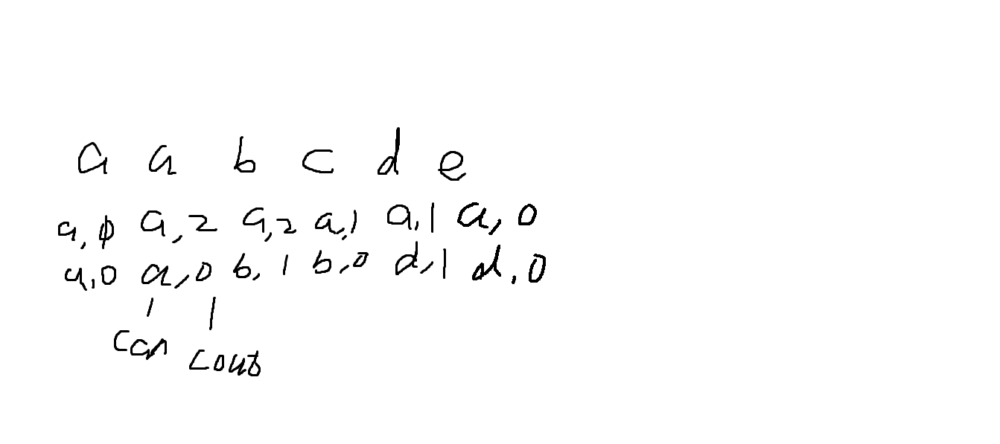

<div align="center">
📖Github
&emsp;&emsp; | &emsp;&emsp;
<a href="https://interview.huihut.com">📚 Docsify</a>
</div> 
<br>

<b><details><summary>💡 关于</summary></b>
📚 本仓库是......

💡 侧边目录支持方式：[📚 Docsify 文档](https://interview.huihut.com)、[Github + TOC 导航](https://github.com/jawil/GayHub)（[TOC预览.png](https://raw.githubusercontent.com/huihut/interview/master/images/TOC预览.png)）

📄 保存为 PDF 方式：使用 Chrome 浏览器打开 <a href="https://interview.huihut.com">📚 Docsify 文档</a> 页面，缩起左侧目录-右键 - 打印 - 选择目标打印机是另存为PDF - 保存（[打印预览.png](https://raw.githubusercontent.com/huihut/interview/master/images/打印预览.png)）

🙏 仓库内容如有错误或改进欢迎 issue 或 pr，建议或讨论可在 [#12](https://github.com/huihut/interview/issues/12) 提出。由于本人水平有限，仓库中的知识点有来自本人原创、读书笔记、书籍、博文等，非原创均已标明出处，如有遗漏，请 issue 提出。本仓库遵循 [CC BY-NC-SA 4.0（署名 - 非商业性使用 - 相同方式共享）](LICENSE) 协议，转载请注明出处，不得用于商业目的。

</details>

🍭 广告与打赏：个人茶余饭后独立开发的一个虚拟形象扮演软件 **《[Avalive](https://store.steampowered.com/app/1137770/Avalive/)》**。打赏请点 [支持赞助](#-支持赞助)。

<!-- ## 📑 目录 -->

<!-- 
* [➕ C/C++](#-cc)
* [⭐️ Effective](#️-effective)
* [📦 STL](#-stl)
* [〽️ 数据结构](#️-数据结构)
* [⚡️ 算法](#️-算法)
* [❓ Problems](#-problems)
* [💻 操作系统](#-操作系统)
* [☁️ 计算机网络](#️-计算机网络)
* [🌩 网络编程](#-网络编程)
* [💾 数据库](#-数据库)
* [📏 设计模式](#-设计模式)
* [⚙️ 链接装载库](#️-链接装载库)
* [📚 书籍](#-书籍)
* [🔱 C/C++ 发展方向](#-cc-发展方向)
* [💯 复习刷题网站](#-复习刷题网站)
* [📝 面试题目经验](#-面试题目经验)
* [📆 招聘时间岗位](#-招聘时间岗位)
* [👍 内推](#-内推)
* [👬 贡献者](#-贡献者)
* [🍭 支持赞助](#-支持赞助)
* [📜 License](#-license) 
-->

## 📑 目录

* [标题](#-1.标题)
* [段落格式](#️-2.段落格式)
* [列表](#-3.列表)
* [区块](#️-4.区块)
* [导入代码](#️-5.导入代码)
* [链接](#-6.链接)
* [导入图片](#-7.导入图片)
* [绘制表格](#-8.绘制表格)
* [高级技巧](#-9.高级技巧)

## 1.标题

### (1) 使用 = 和 - 标记一级和二级标题
    我展示的是一级标题
    =================
    
    我展示的是二级标题
    -----------------

### (2) 使用 # 号标记

    # 一级标题
    ## 二级标题
    ### 三级标题
    #### 四级标题
    ##### 五级标题
    ###### 六级标题

## 2.段落格式

### (1) 字体
    *斜体文本*
    _斜体文本_
    **粗体文本**
    __粗体文本__
    ***粗斜体文本***
    ___粗斜体文本___

### (2) 分割线
***

* * *

*****

- - -

----------

### (3) 删除线
RUNOOB.COM
GOOGLE.COM
~~BAIDU.COM~~

### (4) 下划线
<u>带下划线文本</u>

### (5) 脚注
[^要注明的文本]  
[^RUNOOB]: 菜鸟教程 -- 学的不仅是技术，更是梦想！！！

## 3.列表

* 1
* 2
* 3
  
## 4.区块

> 我是蠢货  
> 可能你不是


> > 你真的好像个傻逼
> >
> > > > 额是吗

## 5.导入代码

### (1) 简单代码
`printf()` 函数  

### (2) 代码块
    int Partition(int data[], int length, int start, int end)
    {
        if(data == NULL || length <= 0 || start < 0 || end >= length)
        {
            // throw new std::exception("Invalid Parameters.");
            throw exception();
            abort();
        }
        int index = RandomInRange(start, end); //选取主元
        cout << "index: " << index << endl;
        Swap(&data[index], &data[end]);  //将主元元素放到数组最后
    
        int small = start - 1;
        for (index = start; index < end; ++index)
        {
            if(data[index] < data[end])
            {
                ++small;
                if(small != index)  //用于记录比主元大的索引
                    Swap(&data[index], &data[small]);
            }
        }
        ++small;
        Swap(&data[small], &data[end]);
        return small;
    }

```cpp
if(data == NULL || length <= 0 || start < 0 || end >= length)
{
    // throw new std::exception("Invalid Parameters.");
    throw exception();
    abort();
}
```

## 6.链接

* [1](#-代码块)
* [2](https://github.com/tamlovincy/interview#-cc)

<https://github.com/tamlovincy/interview#-cc>


## 7.导入图片




## 8.绘制表格

| 左对齐 | 右对齐 | 居中对齐 |
| :-----| ----: | :----: |
| 单元格 | 单元格 | 单元格 |
| 单元格 | 单元格 | 单元格 |

## 9.高级技巧

不在 Markdown 涵盖范围之内的标签，都可以直接在文档里面用 HTML 撰写。

目前支持的 HTML 元素有：\<kbd> \<b> \<i> \<em> \<sup> \<sub> \<br>等 ，如：  

使用 <kbd>Ctrl</kbd>+<kbd>Alt</kbd>+<kbd>Del</kbd> 重启电脑

* **文本加粗**   

+ \*\* 正常显示星号 \*\*

- $$
\mathbf{V}_1 \times \mathbf{V}_2 =  \begin{vmatrix} 
\mathbf{i} & \mathbf{j} & \mathbf{k} \\
\frac{\partial X}{\partial u} &  \frac{\partial Y}{\partial u} & 0 \\
\frac{\partial X}{\partial v} &  \frac{\partial Y}{\partial v} & 0 \\
\end{vmatrix}
$$
