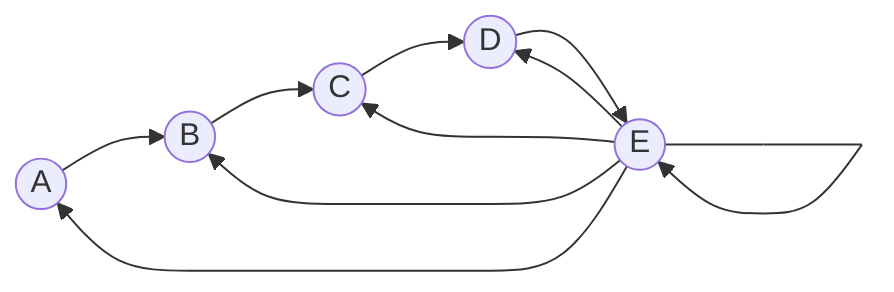
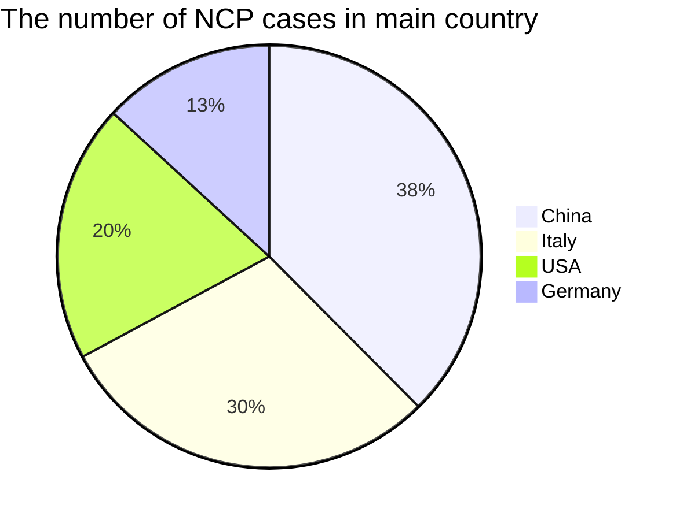

:ski:

:star:

:derelict_house:

:rice:

:book:

:cupid:

:broken_heart:

:train:

:bus:

:car:

:building_construction:

:airplane:

:helicopter:

:rocket:

:triangular_flag_on_post:

:clock1:

:computer:

:mortar_board:

:arrow_lower_left:

|      |      |      |      |
| ---- | :--: | ---- | ---: |
|      |      |      |      |
|      |      |      |      |
|      |      |      |      |

$$
\frac{1}{2}J_{ij}S_i\cdot{S_j}=1\times2\times3\times4
$$

